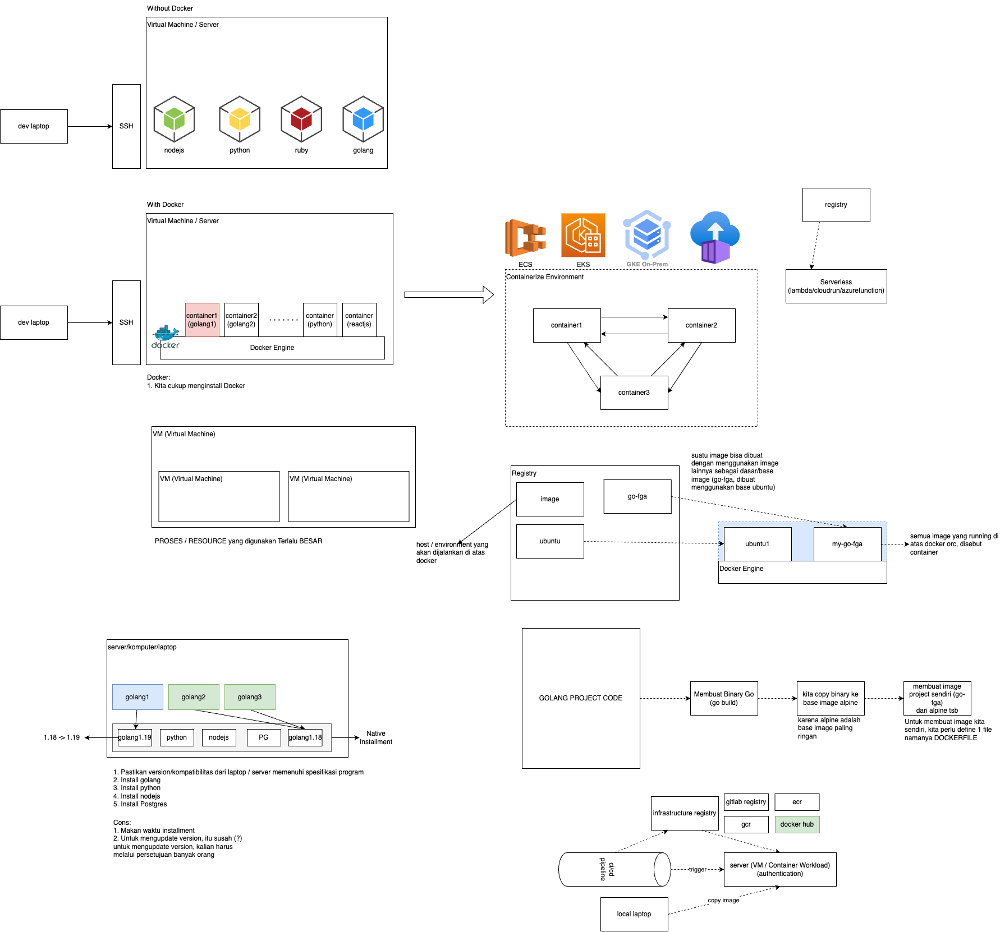

# FGA Kominfo Learning

# Rendering HTML

- Backend:
    sarana meminta resource / data dari server ke client:
        - data (json)
        - html (frontend script untuk menampilkan halaman)
- SSR & CSR
    (Server Side Rendering) -> membentuk suatu web page di server terlebih dahulu, baru dikirimkan ke client
    (Client Side Rendering) -> membentuk web page di client, lalu merequest data web dari server, lalu mengupdate page yang sudah terender di client 
- aplikasi server (backend), dia akan mengeluarkan html endpoint juga untuk kesuatu page (MVC, Model View Controller), ex PHP

Golang bisa membuat MVC -> template rendering (bisa menggunakan HTTP Framework apapun, ex http server, gin, mux, etc)
---
